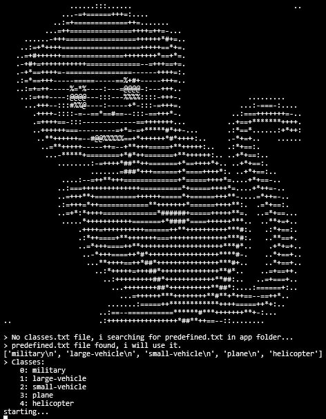

A simple program for viewing (validating) obb datasets and sorting them according to the quality of triggers into three folders: 

neet to be installed python-opencv

- Adequate triggers
- False triggers
- Inappropriate context
